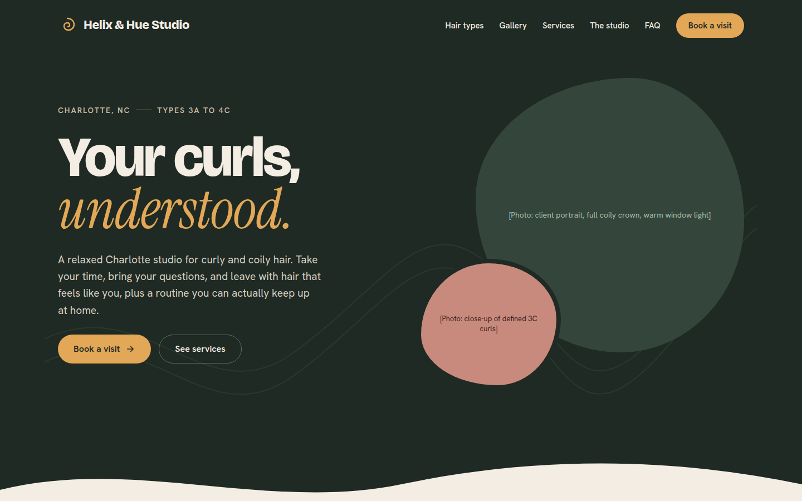
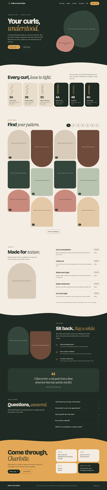
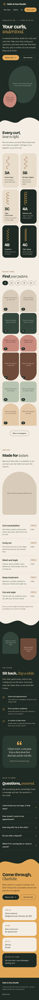
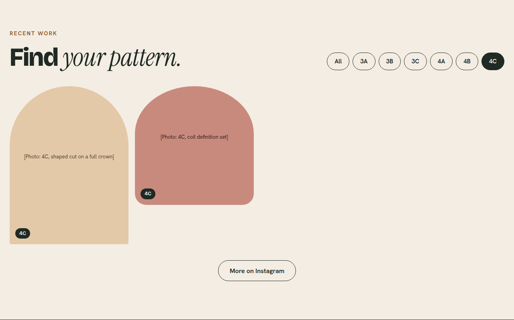

# Helix & Hue Studio

**A UX case study and responsive website for a curly and coily hair stylist in Charlotte, NC.**

Designing a site that turns Instagram curiosity into booked, prepared first-time clients.

[Live site](https://briakgodfrey.github.io/helix-and-hue-studio/) · Role: UX/UI design and front-end development · Type: self-initiated concept (the studio is fictional)



---

## The problem

> People with curly and coily hair can't tell from a stylist's Instagram whether she works with their pattern, what it costs, or how to prepare. So they send a DM, wait, or book somewhere else.

This is a **problem hypothesis**. I did not run interviews for this concept, so every user-facing claim below is labeled as an assumption to test.

**Goals**

- **Clients:** see work on hair like theirs, know the price and time, and book in a few taps.
- **Stylist:** answer fewer repeat DMs, get prepared first-timers, and give her work a home beyond the Instagram grid.

## Process

| Step | What I did |
| --- | --- |
| 01 Discover | Listed my assumptions and audited three competitor homepages |
| 02 Define | Built two proto-personas and a journey map |
| 03 Structure | Sitemap and the user flow from bio link to booking |
| 04 Wireframe | Three hero options, then low-fi desktop and phone pages |
| 05 Design | High-fidelity desktop and phone designs, then built the site |
| 06 Test | Wrote a usability test plan (not yet run) |

## 01 Discover

### Assumptions to validate

| Assumption | How I'd validate it |
| --- | --- |
| New clients find her on Instagram, on a phone | Ask the stylist; check bio link clicks |
| Clients want proof on hair like theirs | Ask 5 people with 3A to 4C hair what convinced them to book their last stylist |
| Hidden prices cause drop-off | Ask whether they've skipped a stylist who didn't list prices |
| The same questions fill her DMs | Ask the stylist for her five most repeated questions |
| Many people don't know their curl type | Ask test participants their type before and after using the page |

### Competitive audit

Three Charlotte curl-focused salon homepages, reviewed September 30, 2026.

| Homepage | Booking | Prices shown | Gallery | Curl types named | FAQ and policies |
| --- | --- | --- | --- | --- | --- |
| [Alyssa Monét](https://www.alyssamonet.net/) | "Book now" leads to a consultation form | One: first curly cut from $250 | Minimal | No | 11-question FAQ |
| [POZA Salon](https://pozasalon.com/) | Many CTAs to an external scheduler | No, separate page | Instagram feed plus before and after | No | Policies linked in footer |
| [Rocol Beauty Studio](https://rocolbeautystudio.com/) | Separate new and returning guest paths | No | Six examples plus social | No, but strong curl-expert messaging | FAQ accordion |

**Opportunities**

- **Name the patterns.** None of the three names 3A to 4C. A type strip and a gallery filtered by type can set the site apart.
- **Show price and time.** Two of three keep prices off the homepage.
- **Give new clients a place to start.** Mark the consultation as where first-timers begin.
- **Keep policies on the page.** A visible FAQ beats a footer link.

## 02 Define

Two **proto-personas**, built from assumptions and the audit rather than interviews:

- **Jasmine, the new natural.** 27, type 4B to 4C, recently stopped relaxing her hair. Needs to see work on tight coils and a clear place for first-timers to start.
- **Monica, the relocator.** 38, type 3B to 3C, just moved to Charlotte. Needs price and time for each service, plus policies and reviews before she commits.

Jasmine's assumed journey dips lowest at **evaluation**: scrolling the grid, she can't tell if this stylist does 4C hair. That became the design's main job.

## 03 Structure

A **single scrolling page**, ordered by the questions a new client asks: *Is this for me? Is she good with hair like mine? What does it cost? How do I book?*

Hero → Hair types → Gallery → Services → The studio → FAQ → Visit

The key decision in the user flow is **"Do I see my pattern?"** If not, the visitor DMs or leaves. So the filterable gallery sits high on the page, before services.

## 04 Wireframes

I sketched three hero layouts:

- **A, split (chosen):** headline and Book button first, curly portrait beside it. Stacks cleanly on a phone.
- **B, full-bleed photo:** dramatic, but text over photos is hard to read on phones and depends on one perfect image.
- **C, type-first:** names the curl types right away, but asks people to self-identify before they trust her.

**Decision:** A for the hero, with C's type strip moved to the next section. Then I built low-fi grayscale wireframes for desktop and phone, starting with the phone.

## 05 Final design

Warm and relaxed: deep forest green, soft linen and honey tones, flowing curves between sections, and a bold grotesque headline paired with an italic serif.

| Desktop | Phone |
| --- | --- |
|  |  |

**Gallery filter.** Tapping a curl type shows only work on that pattern. The chips are real buttons with `aria-pressed`, and a live region announces how many photos are showing.



**Accessibility choices**

- Semantic landmarks, a skip link, and visible focus styles
- Touch targets of at least 44px
- Native `<details>` for the FAQ, so it works by keyboard with no JavaScript
- Every text color meets WCAG AA contrast (4.5:1 or better) against its background
- Reduced motion respected

## 06 Test plan (planned, not yet run)

A moderated, remote test of the phone design with **5 people with 3A to 4C hair** who book salon services at least twice a year. Measures: task success, time on task, and a 1 to 7 ease rating.

| # | Task | Success looks like |
| --- | --- | --- |
| 1 | "In your own words, who is this stylist for?" | Mentions curly or coily hair and Charlotte within 10 seconds |
| 2 | "Find work on hair like yours." | Uses the gallery filter without help |
| 3 | "You're new. What would you book, and what will it cost?" | Picks the consultation and states its price and time |
| 4 | "How should you show up to your appointment?" | Finds the prep answer in the FAQ |
| 5 | "Book your first visit." | Taps Book a visit in under a minute |

**What would change the design:** if 2 or more of 5 miss the gallery filter, move it higher. If prices surprise people, add a "starting at" line near the top.

## What I'd do next

- Run the usability test and replace the assumptions with findings
- Interview a working stylist about her booking and DM workload
- Swap placeholder photos for licensed images or a real stylist's work

## Built with

HTML, CSS and a small amount of vanilla JavaScript. No frameworks or build step.

```
index.html        page markup
css/styles.css    all styles
js/gallery.js     gallery filter
docs/screenshots  images used in this README
```

To run it locally, open `index.html` in a browser.

---

*Helix & Hue Studio is a fictional business created for this concept. Bracketed text such as [PRICE] marks content a real client would supply.*
